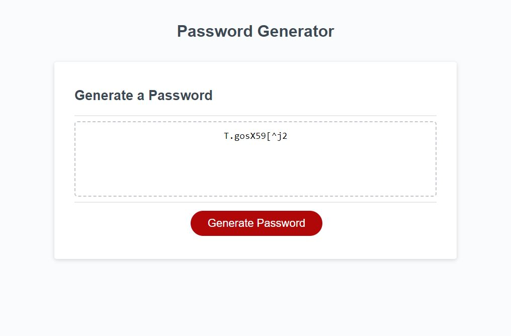

# Personal-Portfolio
## Description
The Password Generator App was created to address the need for strong and unique passwords in today's digital world. As a web developer, I aimed to build a practical application that demonstrates my skills in JavaScript, HTML, and CSS while providing users with a convenient and secure tool for generating strong passwords. Many people struggle to create strong passwords, and the app was designed to offer a user-friendly and reliable solution to this common problem.

The task involved developing a password generator app that runs in the browser and dynamically updates HTML and CSS elements based on user inputs. Users could specify the desired password length within a valid range of 8 to 128 characters and choose from various character types, including lowercase letters, uppercase letters, numeric digits, and special characters. To ensure security, the app enforced the selection of at least one character type and incorporated special characters in the generated passwords. 

Building the Password Generator App was a challenging yet rewarding project that strengthened my technical skills in web development. It highlighted the importance of creating practical tools that positively impact users' digital security. The experience not only enhanced my debugging and troubleshooting skills but also reinforced the significance of building user-focused applications that follow industry standards. Overall, the app serves as a testament to my ability to create functional, secure, and responsive applications that meet user needs.

- [Installation](#installation)
- [Usage](#usage)
- [Credits](#credits)
- [Link](#link)
- [License](#license)
- [Badges](#badges)

## Installation
- produce a reospiteory on GitHUB
- cloned the repository on my Desktop using the SSH Key
- Customised the content of the website by adding JavaScript
## Usage

## Credits
There were no collaborators for this project.

## Link
https://saad-054.github.io/Password-Generator/

## License
MIT License

Copyright (c) 2023 Saad Siddiqui

Permission is hereby granted, free of charge, to any person obtaining a copy
of this software and associated documentation files (the "Software"), to deal
in the Software without restriction, including without limitation the rights
to use, copy, modify, merge, publish, distribute, sublicense, and/or sell
copies of the Software, and to permit persons to whom the Software is
furnished to do so, subject to the following conditions:

The above copyright notice and this permission notice shall be included in all
copies or substantial portions of the Software.

THE SOFTWARE IS PROVIDED "AS IS", WITHOUT WARRANTY OF ANY KIND, EXPRESS OR
IMPLIED, INCLUDING BUT NOT LIMITED TO THE WARRANTIES OF MERCHANTABILITY,
FITNESS FOR A PARTICULAR PURPOSE AND NONINFRINGEMENT. IN NO EVENT SHALL THE
AUTHORS OR COPYRIGHT HOLDERS BE LIABLE FOR ANY CLAIM, DAMAGES OR OTHER
LIABILITY, WHETHER IN AN ACTION OF CONTRACT, TORT OR OTHERWISE, ARISING FROM,
OUT OF OR IN CONNECTION WITH THE SOFTWARE OR THE USE OR OTHER DEALINGS IN THE
SOFTWARE.

## Badges

